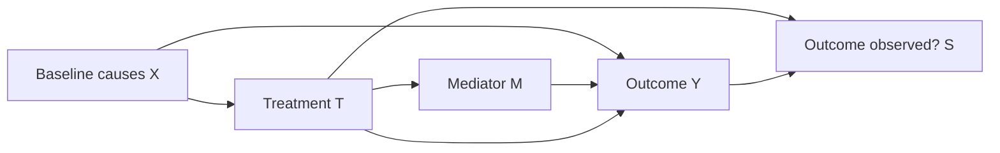

# Identification before estimation

Read when framing the question, building the DAG, or deciding whether the
available data can answer it. The foundations are Hernán and Robins (2020),
Perković et al. (2018), and the DoWhy identification guide; links and verified
titles are in [sources.md](sources.md).

## Estimand contract

An estimand is a defined causal contrast, not the name of an estimator. Record:

| Field | What to establish |
|---|---|
| Intervention/comparator | Offer, eligibility, receipt, dose, timing, or sustained regime; specify versions |
| Outcome | Definition, units, ascertainment, and whether missingness depends on exposure |
| Population | Eligible units, actual treated units, local compliers, trial participants, or a target population |
| Time | Eligibility/assignment time zero, baseline covariate times, follow-up horizon, anticipation |
| Contrast | ATE, ATT, ITT, LATE/local effect, regime effect; difference/ratio or another scale |
| Decision | What action the effect would inform and which magnitude matters |

ATE averages treatment contrasts in a defined population. ATT averages them
among treated units. ITT compares assignment/offer, preserving randomization.
Under extra assumptions, IV identifies an effect for compliers; fuzzy RDD
identifies a complier effect at the cutoff. Neither automatically estimates
the effect of receipt for all treated people or the national ATE. Even an ITT
from a randomized trial requires additional assumptions to generalize beyond
the trial population. See Imbens and Angrist (1994), Imbens and Lemieux (2008),
and Hernán and Robins (2020).

## Causal diagram and variable roles

Use Mermaid or a labeled edge list; a picture alone is insufficient. For each
node record its meaning, timing, observation status, and causal role. Ask about
domain facts the data cannot reveal. Unobserved variables are still nodes.
Distinguish absence of knowledge about an edge from a defended absent edge.

Typical total-effect structure:

Here X is a candidate adjustment variable; M lies on a treatment pathway, and
conditioning on S can select a collider. This diagram is an example, not an
assertion that every analysis has these arrows. The actual graph may include
unobserved common causes, instrument paths, spillovers, or baseline selection.

For the proposed adjustment set, explain why it blocks relevant noncausal
paths and does not block the target effect or open other paths. Predictiveness,
statistical significance, or automatic feature importance is not a causal
adjustment rule. A pretreatment variable can still be a collider. For a direct
effect, state the intervention on the mediator and its additional assumptions;
ordinary regression adjustment for the mediator is not a generic mediation
solution. Use Perković et al. (2018) for graphical adjustment guidance.

For experiments/IV/RDD/DiD, state the assignment/design restrictions too: a
DAG expresses causal pathways but does not by itself supply an RD continuity
or DiD parallel-trends assumption. A disputed graph should yield a conditional
recommendation or explicit competing causal structures.

## Assumption and evidence ledger

| Assumption class | Supporting evidence to inventory | What cannot be concluded from diagnostics |
|---|---|---|
| Consistency/well-defined treatment | Protocol, dose/version, receipt and assignment records | A treatment label alone does not define a common intervention |
| Exchangeability/as-if random assignment | Randomization protocol, institutional assignment rules, sufficient covariate/graph rationale | Covariate balance cannot prove absence of unmeasured confounding |
| Positivity/support | Assignment probabilities or histories, observed support, target restrictions | Regularization, DML or DR cannot identify contrasts in structural support gaps |
| Selection/outcome observation | Sampling, response mechanisms, attrition by assignment/time, linkage options | Similar response rates cannot prove ignorable missingness |
| No interference/stable exposure | Spillover mechanisms, cluster boundaries, donor/comparison contamination | Conventional standard errors do not repair a wrong exposure definition |
| Design-specific restriction | Exclusion, continuity, parallel trends or untreated trajectory rationale | A passed placebo/density/pretrend check cannot verify an untestable restriction |

Distinguish structural positivity failures (some needed treatment histories
are impossible) from finite-sample weak support. If trimming or restricting
the population improves overlap, state the new estimand and its limits. If
partial identification is credible, specify the bounding assumptions rather
than treating a bound as a point effect. Sources: Hernán and Robins (2020),
official EconML DML assumptions, and the relevant design paper.

## Longitudinal and selection issues

Draw time-indexed treatment/confounder nodes when earlier treatment changes
later covariates that affect subsequent treatment and outcome. Conditioning on
all such covariates in an ordinary regression can block part of the effect;
omitting them can leave later confounding. Evaluate a longitudinal g-formula,
marginal structural model with treatment/censoring weights, or another
justified g-method under sequential exchangeability, consistency, and
history-specific positivity. Specify the regime and target population before
choosing a nuisance model. See Hernán and Robins (2020), Part III.

Missing outcomes, survival, survey response, or post-treatment participation
can change who is compared. Retain these processes in the diagram and inventory.
Distinguish outcome observation from treatment positivity. An imputation or
response-weighting plan needs its own defensible observation model and support;
the missing-at-random label is an assumption, not a cleaning operation. For
nonignorable missingness, plan recovery/linkage, sensitivity analysis, or
defensible bounds. Do not condition away attrition and then claim the original
population effect.

## Status and non-identification

Apply the status to the **requested** estimand:

- **Plausibly identified:** explain the identifying design and defended
  assumptions; list remaining empirical checks and untestable assumptions.
- **Conditional:** name each missing material fact and how each possible answer
  changes the choice. The handoff specifies evidence collection before estimation.
- **Not identified:** state the precise obstacle and provide an evidence plan.
  A descriptive estimate, a bound, or a local alternative has its own label and
  target; none is a substitute for the requested effect without agreement.

Identification and precision are separate: small samples may yield weak
inference even for an identifiable target; huge samples may precisely estimate
an association that does not identify the causal target.
