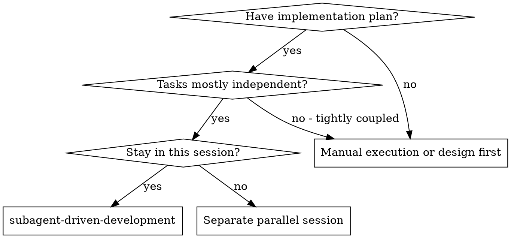
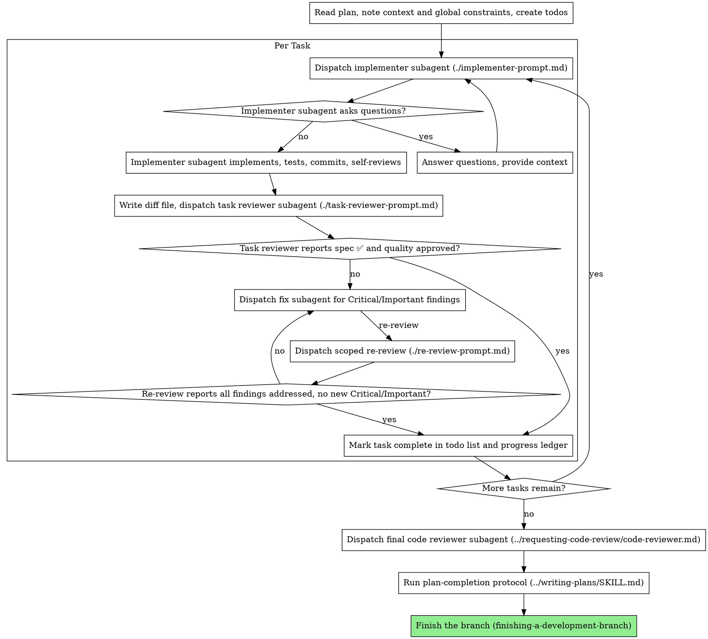

# Subagent-Driven Development

Execute plan by dispatching a fresh implementer subagent per task, a task review (spec compliance + code quality) after each, and a broad whole-branch review at the end.

**Why subagents:** You delegate tasks to specialized agents with isolated context. By precisely crafting their instructions and context, you ensure they stay focused and succeed at their task. They should never inherit your session's context or history — you construct exactly what they need. This also preserves your own context for coordination work.

**Core principle:** Fresh subagent per task + task review (spec + quality) + broad final review = high quality, fast iteration

**Narration:** between tool calls, narrate at most one short line — the
ledger and the tool results carry the record.

**Continuous execution:** Do not pause to check in with your human partner between tasks. Execute tasks without stopping for permission. The only reasons to stop are: BLOCKED status you cannot resolve, ambiguity that genuinely prevents progress, a **context checkpoint** (see Context Checkpoints — a durable handoff to a fresh session, not a check-in), or all tasks complete. "Should I continue?" prompts and progress summaries waste their time — they asked you to execute the plan, so execute it.

## When to Use



**Why same-session (vs. a separate parallel session):**
- Same session (no context switch)
- Fresh subagent per task (no context pollution)
- Review after each task (spec compliance + code quality), broad review at the end
- Faster iteration (no human-in-loop between tasks)

## The Process



**Batch small same-shape work.** When the plan lists several tasks that are
each a small, independent edit of the same kind — the same one-line fix,
constant change, or field addition repeated across files — do not dispatch one
subagent per task. Compose ONE dispatch brief listing every file and its
change, send the whole batch to a single implementer, and review its diff as
one unit. Reserve one-dispatch-per-task for work that needs its own judgment,
its own tests, or its own review surface.

You write the batch brief yourself; `scripts/task-brief` still extracts exactly
one task and gains no multi-task mode. That is a deliberate exception to the
rule that task text stays out of your context: batching applies only to changes
small enough to state in a line each, so the cost is bounded — and teaching
`task-brief` to concatenate sections would pull full task text through your
context for exactly the tasks that need it least.

Write the composed brief to `batch-N-M-brief.md` (the covered task numbers,
e.g. `batch-4-7-brief.md`) in this plan's workspace — the directory this
skill's `scripts/sdd-workspace <plan-file>` prints. Hand that one path to
both the implementer and the reviewer as `[BRIEF_FILE]`, the same handoff
**File Handoffs** gives a single-task brief.

## Pre-Flight Plan Review

Before dispatching Task 1, scan the plan once for conflicts:

- tasks that contradict each other or the plan's Global Constraints
- anything the plan explicitly mandates that the review rubric treats as a
  defect (a test that asserts nothing, verbatim duplication of a logic block)

Present everything you find to your human partner as one batched question —
each finding beside the plan text that mandates it, asking which governs —
before execution begins, not one interrupt per discovery mid-plan. If the
scan is clean, proceed without comment. The review loop remains the net for
conflicts that only emerge from implementation.

## Model Selection

Pick the **cheapest tier that can one-shot the task without a re-loop** — but
on a genuine toss-up between two tiers, **err toward the stronger one.** A model
that takes 2-3× the turns, or comes back wrong and needs a re-dispatch, costs
more than the tier above it; turn count and rework dominate sticker price.

**Tiers** (update these IDs when the lineup changes; the aliases are the durable part):
- **cheap** — Haiku 4.5 (dispatch alias `haiku`)
- **standard** — Sonnet 5 (dispatch alias `sonnet`)
- **capable** — Opus 4.8 (dispatch alias `opus`)

**Always specify the model explicitly when dispatching** — pass the tier's
dispatch alias (`haiku` / `sonnet` / `opus`), not the version ID, which the
dispatch tool's model parameter does not accept. An omitted model inherits your
session's model — usually the most capable and most expensive — silently
defeating this section.

**Choosing the tier — read the signals in order; the first that fires wins:**
1. **Risk / subtlety** — concurrency, security, data-loss, broad blast radius,
   or debugging from symptoms → **capable**, regardless of file count or diff size.
2. **Source of the work** — the complete code is in the brief (transcription +
   testing) → **cheap**; behavior is described in prose → **standard floor**
   (prose implementers never get the cheap tier).
3. **Spread** — 1-2 files with a clear spec → **cheap**; multiple files /
   integration / pattern-matching → **standard**; open design judgment or
   broad-codebase understanding → **capable**.

When nothing clearly fires, default to **standard** — the floor that absorbs the
cost of one wrong cheap pick.

**Reviews** floor at **standard** and scale up with the diff: a small mechanical
diff reviews at **standard**, a subtle or risky change at **capable**. The
**final whole-branch review is always capable** — dispatch it explicitly, not on
the session default.

## Handling Implementer Status

Implementer subagents report one of four statuses. Handle each appropriately:

**DONE:** Generate the review package (`scripts/review-package PLAN_FILE BASE HEAD` — see **File Handoffs** for the BASE rule), then dispatch the task reviewer with the printed path.

**DONE_WITH_CONCERNS:** The implementer completed the work but flagged doubts. Read the concerns before proceeding. If the concerns are about correctness or scope, address them before review. If they're observations (e.g., "this file is getting large"), note them and proceed to review.

**NEEDS_CONTEXT:** The implementer needs information that wasn't provided. Provide the missing context and re-dispatch.

**BLOCKED:** The implementer cannot complete the task. Assess the blocker:
1. If it's a context problem, provide more context and re-dispatch with the same model
2. If context isn't the issue but the task needs more reasoning, raise reasoning effort before switching model, and escalate to a more capable model only once effort has no headroom left (see Fix Rounds)
3. If the task is too large, break it into smaller pieces
4. If the plan itself is wrong, escalate to the human

**Never** ignore an escalation or force the same model to retry without changes. If the implementer said it's stuck, something needs to change.

## Handling Reviewer ⚠️ Items

The task reviewer may report "⚠️ Cannot verify from diff" items — requirements
that live in unchanged code or span tasks. These do not block the rest of the
review, but you must resolve each one yourself before marking the task
complete: you hold the plan and cross-task context the reviewer
lacks. If you confirm an item is a real gap, treat it as a failed spec
review — send it back to the implementer and re-review.

## Fix Rounds

A task gets at most **five fix attempts**. Adjudication follows the fifth; it
is not itself an attempt.

| Round | Action |
|---|---|
| 1-3 | Resume the same implementer with the findings. It appends a fix report to its existing report file: what changed, the covering tests it ran, the command, and the output. |
| 4-5 | Dispatch a **fresh** implementer with the task brief and the findings. Raise reasoning effort when the prior rounds show a thorough attempt rather than a missing-context failure. |
| after 5 | The cap is reached. Adjudicate every still-open finding; dispatch no further fix rounds for this task. |

Re-review each round with the scoped [re-review-prompt.md](re-review-prompt.md),
not a fresh full review — the task review already happened, and re-reading the
whole task every round is the cost this cap exists to bound.

Going fresh at round 4 is the load-bearing half. A resumed implementer carries
its own failed attempts as context, which anchors it to the approach that is not
working; a fresh one does not. Escalate in the order context, then effort, then
model, and stop when there is no headroom — sessions here already run at the
top of the model ladder, so in practice rounds 4-5 buy fresh context and higher
effort, not a bigger model.

**Adjudicating** means you rule on each open finding: record the load-bearing
ones as work, and park the rest in the ledger with your reasoning
(`Ruling: <what you decided> — <why> — <what it costs if wrong>`). Stop for your
human partner only when every path forward is a guess.

## Constructing Reviewer Prompts

Per-task reviews are task-scoped gates. The broad review happens once, at the
final whole-branch review. When you fill a reviewer template:

- Do not add open-ended directives like "check all uses" or "run race tests
  if useful" without a concrete, task-specific reason
- Do not ask a reviewer to re-run tests the implementer already ran on the
  same code — the implementer's report carries the test evidence
- Do not pre-judge findings for the reviewer — never instruct a reviewer to
  ignore or not flag a specific issue. If you believe a finding would be a
  false positive, let the reviewer raise it and adjudicate it in the review
  loop. If the prompt you are writing contains "do not flag," "don't treat X
  as a defect," "at most Minor," or "the plan chose" — stop: you are
  pre-judging, usually to spare yourself a review loop.
- The global-constraints block you hand the reviewer is its attention
  lens. Copy the binding requirements verbatim from the plan's Global
  Constraints section or the spec: exact values, exact formats, and the
  stated relationships between components ("same layout as X", "matches
  Y"). The reviewer's template already carries the process rules (YAGNI,
  test hygiene, review method) — the constraints block is for what THIS
  project's spec demands.
- Hand the reviewer its diff as a file — see **File Handoffs** for the review-package contract.
- A dispatch prompt describes one task, not the session's history. Do not
  paste accumulated prior-task summaries ("state after Tasks 1-3") into
  later dispatches — a real session's dispatch hit 42k chars of which 99%
  was pasted history. A fresh subagent needs its task, the interfaces it
  touches, and the global constraints. Nothing else.
- Dispatch fix subagents for Critical and Important findings. Record Minor
  findings in the progress ledger as you go, and point the final
  whole-branch review at that list so it can triage which must be fixed
  before merge. A roll-up nobody reads is a silent discard.
- A finding labeled plan-mandated — or any finding that conflicts with
  what the plan's text requires — is the human's decision, like any plan
  contradiction: present the finding and the plan text, ask which governs.
  Do not dismiss the finding because the plan mandates it, and do not
  dispatch a fix that contradicts the plan without asking.
- Every fix dispatch carries the implementer contract: the fix subagent
  re-runs the tests covering its change and reports the results. Name the
  covering test files in the dispatch — a one-line fix does not need the
  whole suite. Before re-dispatching the reviewer, confirm the fix report
  contains the covering tests, the command run, and the output; dispatch
  the re-review once all three are present.
- If the final whole-branch review returns findings, dispatch ONE fix
  subagent with the complete findings list — not one fixer per finding.
  Per-finding fixers each rebuild context and re-run suites; a real
  session's final-review fix wave cost more than all its tasks combined.

## Plan Completion

After the final whole-branch review resolves, run the plan-completion
protocol from the writing-plans skill (its "Plan Completion Protocol"
section): resolve-before-defer gate → plan markup → deferred items →
retire. The gate's batched questions are this skill's one deliberate human
checkpoint — fold any question sets already pending (plan-mandated
findings, deferred-Minor confirmations) into the same batch, so your human
partner gets at most one round-trip. Review findings the final review left
unfixed feed the gate. This is compatible with Continuous execution: "all
tasks complete" is a sanctioned stop.

When the plan-completion protocol has finished and the final review's fixes
are merged, delete this plan's workspace — the `$WORKSPACE` you resolved at
skill start: `rm -rf "$WORKSPACE"`. Git history is the record now. Sibling
directories under `.sdd/` belong to other plans — leave them alone, and never
`rm -rf .sdd` itself.

Order matters. The delete runs **after** the protocol, never before: the
resolve-before-defer gate reads this run's leftovers — the ledger, unfixed
review findings, deferred-Minor confirmations — to build its batched questions
and the `specs/deferred_items.md` entries. Deleting the workspace first
destroys the protocol's input.

## File Handoffs

Everything you paste into a dispatch prompt — and everything a subagent
prints back — stays resident in your context for the rest of the session
and is re-read on every later turn. Hand artifacts over as files:

- **Task brief:** before dispatching an implementer, run this skill's
  `scripts/task-brief PLAN_FILE N` — it extracts the task's full text to a
  uniquely named file and prints the path. Compose the dispatch so the
  brief stays the single source of requirements. Your dispatch should
  contain: (1) one line on where this task fits in the project; (2) the
  brief path, introduced as "read this first — it is your requirements,
  including the plan's Global Constraints, with the exact values to use verbatim"; (3) interfaces and decisions
  from earlier tasks that the brief cannot know; (4) your resolution of
  any ambiguity you noticed in the brief; (5) the report-file path and
  report contract. Exact values (numbers, magic strings, signatures, test
  cases) appear only in the brief.
- **Review package (diffs):** generate every reviewer's diff as a file — run
  this skill's `scripts/review-package PLAN_FILE BASE HEAD` and pass the printed path (or,
  without bash: `git log --oneline`, `git diff --stat`, and `git diff -U10` for
  the range, redirected to one uniquely named file). The output never enters
  your context; the reviewer sees the commit list, stat summary, and full diff
  in one Read. **Use the BASE you recorded before dispatching the implementer —
  never `HEAD~1`, which silently drops all but the last commit of a multi-commit
  task.** For the final whole-branch review, BASE is the branch's merge base
  (e.g. `git merge-base main HEAD`).
- **Report file:** name the implementer's report file after the brief
  (brief `…/task-N-brief.md` → report `…/task-N-report.md`) and put it in
  the dispatch prompt. The implementer writes the full report there and
  returns only status, commits, a one-line test summary, and concerns.
- **Reviewer inputs:** the task reviewer gets three paths — the same brief
  file, the report file, and the review package — plus the global
  constraints that bind the task.
- Fix dispatches append their fix report (with test results) to the same
  report file and return a short summary; re-reviews read the updated file.

## Durable Progress

Conversation memory does not survive compaction. In real sessions,
controllers that lost their place have re-dispatched entire completed task
sequences — the single most expensive failure observed. Track progress in
a ledger file, not only in todos.

- At skill start, run this skill's `scripts/sdd-workspace <plan-file>` once and
  keep the directory it prints — it creates this plan's workspace and the
  self-ignoring .gitignore that covers every plan's:
  `WORKSPACE=$(scripts/sdd-workspace <plan-file>)`. Then check for a ledger:
  `cat "$WORKSPACE/progress.md"`. Tasks listed there as complete are DONE — do
  not re-dispatch them; resume at the first task not marked complete.
- The workspace is per plan, so that ledger is always this plan's. Its first
  line names the plan it belongs to; if that name is not the plan in your hand,
  stop and say so rather than resuming against it.
- **On resume after a checkpoint, reconcile before dispatching.** Before
  dispatching the first incomplete task, replay the ledger's `deviation` lines:
  for any interface a coming task consumes, trust the ledger's actual signature
  over the plan's `Produces:` block, and if one is still in doubt confirm it
  with `git show <SHA>:<path>`. This repairs the cross-task context that
  `/clear` dropped — without it a relaunched controller dispatches stale
  signatures and the build breaks or the implementer stalls on NEEDS_CONTEXT.
- When you create the ledger, write its first line as
  `Plan: <plan-file-path>`. A workspace is named from the plan's basename, so
  two plans with the same basename in different directories would collide;
  this line is what makes that visible instead of silent.
- When a task's review comes back clean, append one line to the ledger in
  the same message as your other bookkeeping:
  `Task N: complete (commits <base7>..<head7>, review clean)`.
- A batched dispatch gets ONE ledger entry naming every task number it covered:
  `Tasks 4-7: complete (batched; commits <base7>..<head7>, review clean)`. A
  resuming controller reads task numbers from that line, so a batch recorded
  under only its first task's number re-dispatches the rest.
- The ledger is your recovery map: the commits it names exist in git even
  when your context no longer remembers creating them. After compaction,
  trust the ledger and `git log` over your own recollection.
- `git clean -fdx` will destroy the ledger (the `.sdd` parent's self-ignoring
  .gitignore keeps every plan's workspace out of git, but `-x` removes ignored
  files too); if that happens, recover from `git log`.

## Context Checkpoints

Everything you dispatch and every report you read stays resident in your
context, re-read on every later turn at cache-read cost. On a long plan this
recurring cost grows with each task — the controller's accumulated history, not
the work, becomes the dominant spend. Cap it by resetting context at a task
boundary and handing off to a fresh session that resumes where this one stopped.

A checkpoint is **not** a "should I continue?" check-in (still banned) and never
interrupts a task — it is a durable handoff taken only at a clean boundary.

**When:** at a task boundary (never mid-task, never with a review loop open)
when the harness signals context pressure — a compaction warning, or context
you notice has grown large. Many tasks since the last fresh start is a weak
secondary hint, not a trigger by itself; task sizes vary, so read the
context-pressure signal, not a task count.

**How:**
1. **Capture cross-task state the ledger lacks.** The plan's `Produces:` blocks
   carry each task's *planned* interfaces, not what changed during execution.
   For each task done since the last fresh start, append any plan deviation a
   later implementer must know — a renamed symbol, a changed signature, or an
   unanticipated decision (`Task 3: deviation — plan said clearLayers(); shipped
   clearAll()`). A task that matched its plan needs no line. After `/clear` your
   memory of these is gone; the ledger is the only carrier.
2. Confirm the ledger's completion lines are current through the last finished
   task and that their commits exist in `git log`.
3. In one line, tell your human partner which tasks are complete, that the
   ledger is current, and that you recommend `/clear` + relaunching
   subagent-driven-development on the same plan to resume with fresh context —
   with the cost reason. Then stop; the relaunch resumes from the ledger via
   Durable Progress above.

## Prompt Templates

- [implementer-prompt.md](implementer-prompt.md) - Dispatch implementer subagent
- [task-reviewer-prompt.md](task-reviewer-prompt.md) - Dispatch task reviewer subagent (spec compliance + code quality)
- [re-review-prompt.md](re-review-prompt.md) - Dispatch a scoped re-review after fixes (per-finding ADDRESSED / NOT ADDRESSED)
- Final whole-branch review: use requesting-code-review's [code-reviewer.md](../requesting-code-review/code-reviewer.md)

## Example Workflow

```
You: I'm using Subagent-Driven Development to execute this plan.

[Read plan file once: specs/plans/7-feature-name.md]
[Create todos for all tasks]

Task 1: Hook installation script

[Run task-brief for Task 1; dispatch implementer with brief + report paths + context]

Implementer (final message): NEEDS_CONTEXT — "Should the hook be installed
  at user or system level?"

You: [Re-dispatch the implementer with the same brief plus: "User level (~/.claude/hooks/)"]

Implementer (second run):
  - Implemented install-hook command
  - Added tests, 5/5 passing
  - Self-review: Found I missed --force flag, added it
  - Committed

[Run review-package, dispatch task reviewer with the printed path]
Task reviewer: Spec ✅ - all requirements met, nothing extra.
  Strengths: Good test coverage, clean. Issues: None. Task quality: Approved.

[Mark Task 1 complete]

Task 2: Recovery modes

[Run task-brief for Task 2; dispatch implementer with brief + report paths + context]

Implementer: [No questions, proceeds]
Implementer:
  - Added verify/repair modes
  - 8/8 tests passing
  - Self-review: All good
  - Committed

[Run review-package, dispatch task reviewer with the printed path]
Task reviewer: Spec ❌:
  - Missing: Progress reporting (spec says "report every 100 items")
  - Extra: Added --json flag (not requested)
  Issues (Important): Magic number (100)

[Dispatch fix subagent with all findings]
Fixer: Removed --json flag, added progress reporting, extracted PROGRESS_INTERVAL constant

[Dispatch scoped re-review (re-review-prompt.md) with the numbered findings]
Re-reviewer:
  1. Missing progress reporting — ADDRESSED (reports every PROGRESS_INTERVAL items)
  2. Extra --json flag — ADDRESSED (removed)
  3. Magic number (100) — ADDRESSED (extracted to PROGRESS_INTERVAL)
  No new findings.

[Mark Task 2 complete]

...

[After all tasks]
[Dispatch final code-reviewer]
Final reviewer: All requirements met, ready to merge

Done!
```

## Advantages

**vs. Manual execution:**
- Subagents follow TDD naturally
- Fresh context per task (no confusion)
- Isolated context per dispatch (no cross-task contamination)
- Subagent can surface questions (a NEEDS_CONTEXT report; controller answers and re-dispatches)

**vs. Executing Plans:**
- Same session (no handoff)
- Continuous progress (no waiting)
- Review checkpoints automatic

**Efficiency gains:**
- Controller curates exactly what context is needed; bulk artifacts move
  as files, not pasted text
- Subagent gets complete information upfront
- Questions surfaced before work begins (not after)

**Quality gates:**
- Self-review catches issues before handoff
- Task review carries two verdicts: spec compliance and code quality
- Review loops ensure fixes actually work
- Spec compliance prevents over/under-building
- Code quality ensures implementation is well-built

**Cost:**
- More subagent invocations (implementer + reviewer per task)
- Controller does more prep work (extracting all tasks upfront)
- Review loops add iterations
- But catches issues early (cheaper than debugging later)

## Red Flags

**Never:**
- Start implementation on main/master branch without explicit user consent
- Skip task review, or accept a report missing either verdict (spec compliance AND task quality are both required)
- Proceed with unfixed issues
- Dispatch multiple implementation subagents in parallel (conflicts)
- Make a subagent read the whole plan file (hand it its task brief —
  `scripts/task-brief` — instead)
- Skip scene-setting context (subagent needs to understand where task fits)
- Ignore a NEEDS_CONTEXT report (answer the questions and re-dispatch before moving on)
- Accept "close enough" on spec compliance (reviewer found spec issues = not done)
- Skip review loops (reviewer found issues = implementer fixes = review again)
- Let implementer self-review replace actual review (both are needed)
- Tell a reviewer what not to flag, or pre-rate a finding's severity — see **Constructing Reviewer Prompts**
- Dispatch a task reviewer without a diff file — generate it first
  (`scripts/review-package PLAN_FILE BASE HEAD`) and name the printed path in the
  prompt
- Move to next task while the review has open Critical/Important issues
- Re-dispatch a task the progress ledger already marks complete — check
  the ledger (and `git log`) after any compaction or resume

**If subagent reports NEEDS_CONTEXT:**
- Answer every question clearly and completely
- Re-dispatch with the same brief plus the answers
- Add the context the brief was missing so the second run can one-shot it

**If reviewer finds issues:**
- Dispatch a fix subagent with the findings (per Constructing Reviewer Prompts)
- Reviewer reviews again (scoped re-review, not a fresh full review — see Fix Rounds)
- Repeat up to the five-attempt cap, then adjudicate what's still open (see Fix Rounds)
- Don't skip the re-review

**If subagent fails task:**
- Dispatch fix subagent with specific instructions
- Don't try to fix manually (context pollution)

## Integration

**Required workflow skills:**
- **using-git-worktrees** - Ensures isolated workspace (creates one or verifies existing)
- **writing-plans** - Creates the plan this skill executes
- **requesting-code-review** - Code review template for the final whole-branch review
- **finishing-a-development-branch** - Integrates the branch after the plan-completion protocol

**After all tasks:** run the plan-completion protocol, then use finishing-a-development-branch to integrate the branch (merge / PR / cleanup) and remove any worktree.

**Subagents follow TDD** (red → green → refactor) for each task.

**Alternative:** for a separate parallel session instead of same-session execution, run the plan task-by-task in that session.
