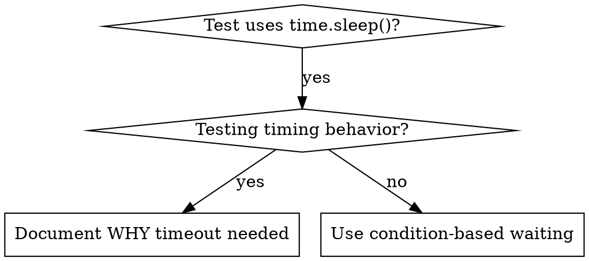

# Condition-Based Waiting

## Overview

Flaky tests often guess at timing with arbitrary delays. This creates race conditions where tests pass on fast machines but fail under load or in CI.

**Core principle:** Wait for the actual condition you care about, not a guess about how long it takes.

## When to Use



**Use when:**
- Tests have arbitrary delays (`time.sleep()`)
- Tests are flaky (pass sometimes, fail under load)
- Tests timeout when run in parallel
- Waiting for async operations to complete

**Don't use when:**
- Testing actual timing behavior (debounce, throttle intervals)
- Always document WHY if using arbitrary timeout

## Core Pattern

```python
# ❌ BEFORE: guessing at timing
time.sleep(0.05)
result = get_result()
assert result is not None

# ✅ AFTER: waiting for the condition
wait_for(lambda: get_result() is not None, "result")
result = get_result()
assert result is not None
```

## Quick Patterns

| Scenario | Pattern |
|----------|---------|
| Wait for event | `wait_for(lambda: any(e.type == "DONE" for e in events), "DONE")` |
| Wait for state | `wait_for(lambda: machine.state == "ready", "ready")` |
| Wait for count | `wait_for(lambda: len(items) >= 5, "5 items")` |
| Wait for file | `wait_for(lambda: path.exists(), "file")` |
| Complex condition | `wait_for(lambda: obj.ready and obj.value > 10, "obj ready")` |

## Implementation

Generic polling function:
```python
def wait_for(predicate, description, timeout=5.0, interval=0.01):
    deadline = time.monotonic() + timeout
    while True:
        value = predicate()
        if value:
            return value
        if time.monotonic() > deadline:
            raise TimeoutError(
                f"Timed out waiting for {description} after {timeout}s"
            )
        time.sleep(interval)  # poll every 10ms
```

See `condition_based_waiting_example.py` in this directory for the helper plus thin domain wrappers (`wait_for_event`, `wait_for_event_count`, `wait_for_file`).

## Common Mistakes

**❌ Polling too fast:** `time.sleep(0.001)` - wastes CPU
**✅ Fix:** Poll every 10ms

**❌ No timeout:** Loop forever if condition never met
**✅ Fix:** Always include timeout with clear error

**❌ Stale data:** Cache state before loop
**✅ Fix:** Call getter inside loop for fresh data

## When Arbitrary Timeout IS Correct

```python
# Worker ticks every 100ms — need 2 ticks to verify partial output
wait_for(lambda: worker.started, "worker started")  # first: wait for condition
time.sleep(0.2)  # then: wait for timed behavior
# 200ms = 2 ticks at 100ms intervals — documented and justified
```

**Requirements:**
1. First wait for triggering condition
2. Based on known timing (not guessing)
3. Comment explaining WHY

## Real-World Impact

From debugging session (2025-10-03):
- Fixed 15 flaky tests across 3 files
- Pass rate: 60% → 100%
- Execution time: 40% faster
- No more race conditions
